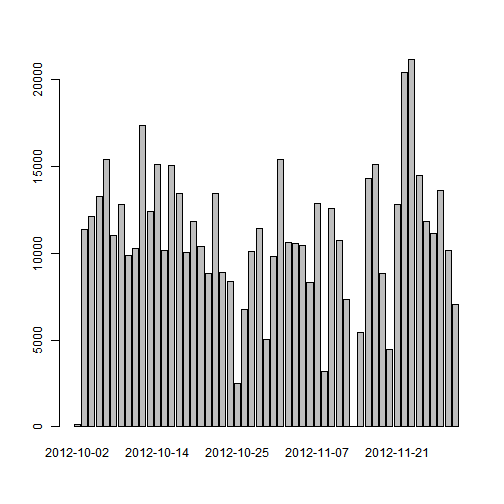
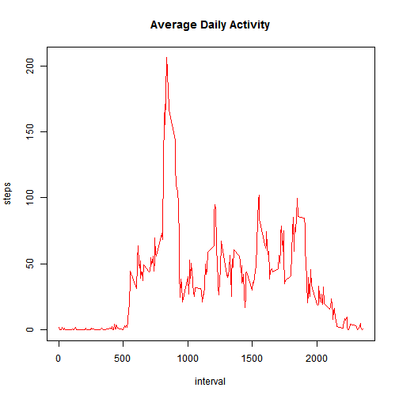
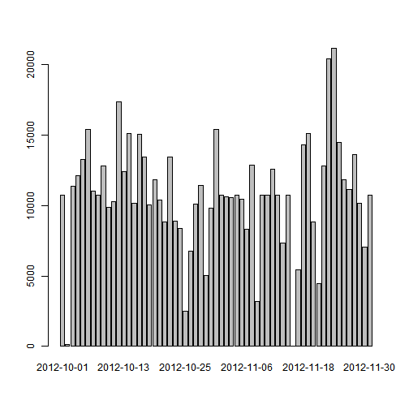

# Reproducible Research: Peer Assessment 1

Activity analysis for Coursera's Reproducible Reseach: Peer Assessment 1.

## Loading and preprocessing the data
Data was stored in csv file. Let's load it and have an overview.
Also, remove rows with missing values.

```r
all_activity_data <-  read.csv('activity.csv')
summary(all_activity_data)
```

```
##      steps               date          interval   
##  Min.   :  0.0   2012-10-01:  288   Min.   :   0  
##  1st Qu.:  0.0   2012-10-02:  288   1st Qu.: 589  
##  Median :  0.0   2012-10-03:  288   Median :1178  
##  Mean   : 37.4   2012-10-04:  288   Mean   :1178  
##  3rd Qu.: 12.0   2012-10-05:  288   3rd Qu.:1766  
##  Max.   :806.0   2012-10-06:  288   Max.   :2355  
##  NA's   :2304    (Other)   :15840
```

```r
ok <- complete.cases(all_activity_data)
activity_data <- all_activity_data[ok,]
```


## What is mean total number of steps taken per day?
To calculate this value, first, we need calculate number of steps per each day.
Function **aggregate** breaks data into groups.
We will group **steps** variable into groups with the same date (**date** column).
For each group we will apply **sum** function to calculate total steps taken each day.

```r
steps_per_day <- aggregate(steps ~ date, activity_data, sum)
summary(steps_per_day)
```

```
##          date        steps      
##  2012-10-02: 1   Min.   :   41  
##  2012-10-03: 1   1st Qu.: 8841  
##  2012-10-04: 1   Median :10765  
##  2012-10-05: 1   Mean   :10766  
##  2012-10-06: 1   3rd Qu.:13294  
##  2012-10-07: 1   Max.   :21194  
##  (Other)   :47
```

```r
barplot(steps_per_day$steps, names.arg=steps_per_day$date)
```

 

Calculate mean of steps per day:

```r
mean(steps_per_day[['steps']])
```

```
## [1] 10766
```
Calculate median of steps per day:

```r
median(steps_per_day[['steps']])
```

```
## [1] 10765
```

## What is the average daily activity pattern?
Let's see how average day looks like. Group **steps** into **interval** accross 
all the days and calculate mean on each group. The **aggregate** function to the resque!

```r
avg_daily_activity <- aggregate(steps ~ interval, activity_data, mean)
plot(avg_daily_activity, type='l', main='Average Daily Activity', col='red')
```

 

Find interval which on average contains maximum number of steps:

```r
avg_daily_activity[which.max(avg_daily_activity$steps),]
```

```
##     interval steps
## 104      835 206.2
```

## Imputing missing values
Until now, we ignored missing values in our input data set.
There is :

```r
ok <- complete.cases(all_activity_data)
sum(!ok)
```

```
## [1] 2304
```
rows with missing values.


### Strategy for filling missing values
If there is no value of steps for given row, we are going to use
mean for this interval averaged over all the days. Those were calculated for **Daily activity pattern**.

```r
for (i in 1:length(all_activity_data$steps)) {
    if (is.na(all_activity_data$steps[i])) { 
        this_interval <- all_activity_data$interval[i]
        all_activity_data$steps[i] <- avg_daily_activity$steps[avg_daily_activity$interval == this_interval] #use interval mean 
    }
    
}
```

Verify that all missing values were filled.

```r
ok <- complete.cases(all_activity_data)
sum(!ok)
```

```
## [1] 0
```

Now, analyze what is the impact of such strategy of filling missing values on mean and median
number of steps. Let's do the same operations as previously.

```r
steps_per_day_full <- aggregate(steps ~ date, all_activity_data, sum)
barplot(steps_per_day_full$steps, names.arg=steps_per_day_full$date)
```

 

```r
mean(steps_per_day_full[['steps']])
```

```
## [1] 10766
```

```r
median(steps_per_day_full[['steps']])
```

```
## [1] 10766
```
We shall notice that obtained values are the same as for data with missing values.

## Are there differences in activity patterns between weekdays and weekends?
there is something different
