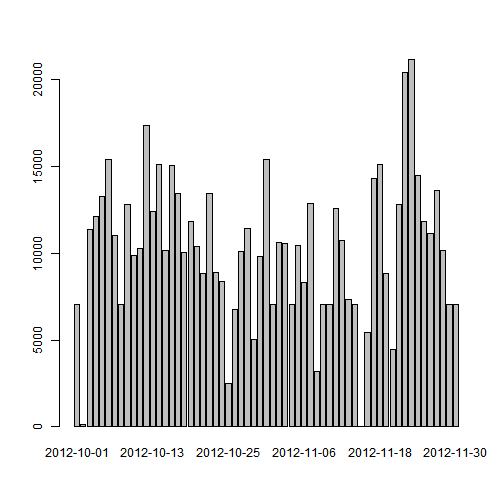

# Reproducible Research: Peer Assessment 1

Activity analysis for Coursera's Reproducible Reseach: Peer Assessment 1.

## Loading and preprocessing the data
Data was stored in csv file. Let's load it and have an overview.


```r
activity_data <-  read.csv('activity.csv')
summary(activity_data)
```

```
##      steps               date          interval   
##  Min.   :  0.0   2012-10-01:  288   Min.   :   0  
##  1st Qu.:  0.0   2012-10-02:  288   1st Qu.: 589  
##  Median :  0.0   2012-10-03:  288   Median :1178  
##  Mean   : 37.4   2012-10-04:  288   Mean   :1178  
##  3rd Qu.: 12.0   2012-10-05:  288   3rd Qu.:1766  
##  Max.   :806.0   2012-10-06:  288   Max.   :2355  
##  NA's   :2304    (Other)   :15840
```


## What is mean total number of steps taken per day?
To calculate this value, first, we need calculate number of steps per each day.
Function **aggregate** breaks data into groups.
We will group **steps** variable into groups with the same date (**date** column).
For each group we will apply **sum** function to calculate total steps taken each day.

```r
sum_helper <- function(data) {
    sum(data, na.rm=TRUE)
}
steps_per_day <- aggregate(steps ~ date, activity_data, sum_helper)
barplot(steps_per_day$steps, names.arg=steps_per_day$date)
```

 

Calculate mean of steps per day:

```r
mean(steps_per_day[['steps']])
```

```
## [1] 10766
```
Calculate median of steps per day:

```r
median(steps_per_day[['steps']])
```

```
## [1] 10765
```

## What is the average daily activity pattern?
Let's see how average day looks like. Group **steps** into **interval** accross 
all the days and calculate mean on each group. The **aggregate** function to the resque!

```r
mean_helper <- function(data) {
    mean(data, na.rm=TRUE)
}
avg_daily_activity <- aggregate(steps ~ interval, activity_data, mean_helper)
plot(avg_daily_activity, type='l', main='Average Daily Activity', col='red')
```

 

Find interval which on average contains maximum number of steps:

```r
avg_daily_activity[which.max(avg_daily_activity$steps),]
```

```
##     interval steps
## 104      835 206.2
```

## Imputing missing values
Until now, we ignored missing values in our input data set.
There is :

```r
ok <- complete.cases(activity_data)
sum(!ok)
```

```
## [1] 2304
```
rows with missing values.


### Strategy for filling missing values
If there is no value of steps for given row, we are going to use
mean for this interval averaged over all the days. Those were calculated for **Daily activity pattern**.

```r
for (i in 1:length(activity_data$steps)) {
    if (is.na(activity_data$steps[i])) { 
        this_interval <- activity_data$interval[i]
    #    print(this_interval)
     #   print(avg_daily_activity$steps[this_interval / 5 + 1])
        activity_data$steps[i] <- avg_daily_activity$steps[this_interval / 5  + 1] #use interval mean 
        print(activity_data$steps[i])
    }
    
}
```

```
## [1] 1.717
## [1] 0.3396
## [1] 0.1321
## [1] 0.1509
## [1] 0.07547
## [1] 2.094
## [1] 0.5283
## [1] 0.8679
## [1] 0
## [1] 1.472
## [1] 0.3019
## [1] 0.1321
## [1] 0.1698
## [1] 0.3774
## [1] 0.2642
## [1] 0
## [1] 0
## [1] 0
## [1] 1.132
## [1] 0
## [1] 0
## [1] 0.1321
## [1] 0
## [1] 0.2264
## [1] 0.2075
## [1] 0.6226
## [1] 1.623
## [1] 0.5849
## [1] 0.4906
## [1] 0.07547
## [1] 0
## [1] 0
## [1] 1.189
## [1] 0.9434
## [1] 2.566
## [1] 0
## [1] 0
## [1] 1.566
## [1] 3
## [1] 2.245
## [1] 3.321
## [1] 2.962
## [1] 2.094
## [1] 6.057
## [1] 16.02
## [1] 18.34
## [1] 39.45
## [1] 44.49
## [1] 44.02
## [1] 44.17
## [1] 37.36
## [1] 49.04
## [1] 43.81
## [1] 44.38
## [1] 50.51
## [1] 54.51
## [1] 49.92
## [1] 50.98
## [1] 55.68
## [1] 44.32
## [1] 171.2
## [1] 155.4
## [1] 177.3
## [1] 206.2
## [1] 195.9
## [1] 179.6
## [1] 183.4
## [1] 167
## [1] 143.5
## [1] 124
## [1] 109.1
## [1] 108.1
## [1] 40.57
## [1] 26.98
## [1] 42.42
## [1] 52.66
## [1] 38.92
## [1] 50.79
## [1] 44.28
## [1] 37.42
## [1] 34.7
## [1] 28.34
## [1] 25.09
## [1] 31.94
## [1] 42.04
## [1] 44.6
## [1] 46.04
## [1] 59.19
## [1] 63.87
## [1] 87.7
## [1] 94.85
## [1] 92.77
## [1] 63.4
## [1] 50.17
## [1] 54.47
## [1] 32.42
## [1] 46.25
## [1] 56.43
## [1] 42.75
## [1] 25.13
## [1] 39.96
## [1] 53.55
## [1] 47.32
## [1] 60.81
## [1] 55.75
## [1] 51.96
## [1] 43.58
## [1] 48.7
## [1] 30.02
## [1] 36.08
## [1] 35.49
## [1] 38.85
## [1] 45.96
## [1] 47.75
## [1] 48.13
## [1] 65.32
## [1] 82.91
## [1] 98.66
## [1] 102.1
## [1] 83.96
## [1] 44.66
## [1] 45.45
## [1] 46.21
## [1] 43.68
## [1] 46.62
## [1] 56.3
## [1] 50.72
## [1] 61.23
## [1] 72.72
## [1] 78.94
## [1] 68.94
## [1] 59.66
## [1] 59.26
## [1] 67.77
## [1] 77.7
## [1] 74.25
## [1] 85.34
## [1] 99.45
## [1] 86.58
## [1] 85.6
## [1] 84.87
## [1] 77.83
## [1] 58.04
## [1] 53.36
## [1] 19.62
## [1] 19.02
## [1] 19.34
## [1] 33.34
## [1] 26.81
## [1] 21.17
## [1] 27.3
## [1] 21.34
## [1] 19.55
## [1] 21.32
## [1] 32.3
## [1] 20.15
## [1] 8.679
## [1] 7.792
## [1] 8.132
## [1] 2.623
## [1] 1.453
## [1] 3.679
## [1] 4.811
## [1] 8.509
## [1] 7.075
## [1] 8.698
## [1] 9.755
## [1] 2.208
## [1] 0.9623
## [1] 1.585
## [1] 2.604
## [1] 4.698
## [1] 3.302
## [1] 0.6415
## [1] 0.2264
## [1] 1.075
## [1] NA
## [1] NA
## [1] NA
## [1] NA
## [1] NA
## [1] NA
## [1] NA
## [1] NA
## [1] NA
## [1] NA
## [1] NA
## [1] NA
## [1] NA
## [1] NA
## [1] NA
## [1] NA
## [1] NA
## [1] NA
## [1] NA
## [1] NA
## [1] NA
## [1] NA
## [1] NA
## [1] NA
## [1] NA
## [1] NA
## [1] NA
## [1] NA
## [1] NA
## [1] NA
## [1] NA
## [1] NA
## [1] NA
## [1] NA
## [1] NA
## [1] NA
## [1] NA
## [1] NA
## [1] NA
## [1] NA
## [1] NA
## [1] NA
## [1] NA
## [1] NA
## [1] NA
## [1] NA
## [1] NA
## [1] NA
## [1] NA
## [1] NA
## [1] NA
## [1] NA
## [1] NA
## [1] NA
## [1] NA
## [1] NA
## [1] NA
## [1] NA
## [1] NA
## [1] NA
## [1] NA
## [1] NA
## [1] NA
## [1] NA
## [1] NA
## [1] NA
## [1] NA
## [1] NA
## [1] NA
## [1] NA
## [1] NA
## [1] NA
## [1] NA
## [1] NA
## [1] NA
## [1] NA
## [1] NA
## [1] NA
## [1] NA
## [1] NA
## [1] NA
## [1] NA
## [1] NA
## [1] NA
## [1] NA
## [1] NA
## [1] NA
## [1] NA
## [1] NA
## [1] NA
## [1] NA
## [1] NA
## [1] NA
## [1] NA
## [1] NA
## [1] NA
## [1] NA
## [1] NA
## [1] NA
## [1] NA
## [1] NA
## [1] NA
## [1] NA
## [1] NA
## [1] NA
## [1] NA
## [1] NA
## [1] NA
## [1] NA
## [1] NA
## [1] NA
## [1] NA
## [1] 1.717
## [1] 0.3396
## [1] 0.1321
## [1] 0.1509
## [1] 0.07547
## [1] 2.094
## [1] 0.5283
## [1] 0.8679
## [1] 0
## [1] 1.472
## [1] 0.3019
## [1] 0.1321
## [1] 0.1698
## [1] 0.3774
## [1] 0.2642
## [1] 0
## [1] 0
## [1] 0
## [1] 1.132
## [1] 0
## [1] 0
## [1] 0.1321
## [1] 0
## [1] 0.2264
## [1] 0.2075
## [1] 0.6226
## [1] 1.623
## [1] 0.5849
## [1] 0.4906
## [1] 0.07547
## [1] 0
## [1] 0
## [1] 1.189
## [1] 0.9434
## [1] 2.566
## [1] 0
## [1] 0
## [1] 1.566
## [1] 3
## [1] 2.245
## [1] 3.321
## [1] 2.962
## [1] 2.094
## [1] 6.057
## [1] 16.02
## [1] 18.34
## [1] 39.45
## [1] 44.49
## [1] 44.02
## [1] 44.17
## [1] 37.36
## [1] 49.04
## [1] 43.81
## [1] 44.38
## [1] 50.51
## [1] 54.51
## [1] 49.92
## [1] 50.98
## [1] 55.68
## [1] 44.32
## [1] 171.2
## [1] 155.4
## [1] 177.3
## [1] 206.2
## [1] 195.9
## [1] 179.6
## [1] 183.4
## [1] 167
## [1] 143.5
## [1] 124
## [1] 109.1
## [1] 108.1
## [1] 40.57
## [1] 26.98
## [1] 42.42
## [1] 52.66
## [1] 38.92
## [1] 50.79
## [1] 44.28
## [1] 37.42
## [1] 34.7
## [1] 28.34
## [1] 25.09
## [1] 31.94
## [1] 42.04
## [1] 44.6
## [1] 46.04
## [1] 59.19
## [1] 63.87
## [1] 87.7
## [1] 94.85
## [1] 92.77
## [1] 63.4
## [1] 50.17
## [1] 54.47
## [1] 32.42
## [1] 46.25
## [1] 56.43
## [1] 42.75
## [1] 25.13
## [1] 39.96
## [1] 53.55
## [1] 47.32
## [1] 60.81
## [1] 55.75
## [1] 51.96
## [1] 43.58
## [1] 48.7
## [1] 30.02
## [1] 36.08
## [1] 35.49
## [1] 38.85
## [1] 45.96
## [1] 47.75
## [1] 48.13
## [1] 65.32
## [1] 82.91
## [1] 98.66
## [1] 102.1
## [1] 83.96
## [1] 44.66
## [1] 45.45
## [1] 46.21
## [1] 43.68
## [1] 46.62
## [1] 56.3
## [1] 50.72
## [1] 61.23
## [1] 72.72
## [1] 78.94
## [1] 68.94
## [1] 59.66
## [1] 59.26
## [1] 67.77
## [1] 77.7
## [1] 74.25
## [1] 85.34
## [1] 99.45
## [1] 86.58
## [1] 85.6
## [1] 84.87
## [1] 77.83
## [1] 58.04
## [1] 53.36
## [1] 19.62
## [1] 19.02
## [1] 19.34
## [1] 33.34
## [1] 26.81
## [1] 21.17
## [1] 27.3
## [1] 21.34
## [1] 19.55
## [1] 21.32
## [1] 32.3
## [1] 20.15
## [1] 8.679
## [1] 7.792
## [1] 8.132
## [1] 2.623
## [1] 1.453
## [1] 3.679
## [1] 4.811
## [1] 8.509
## [1] 7.075
## [1] 8.698
## [1] 9.755
## [1] 2.208
## [1] 0.9623
## [1] 1.585
## [1] 2.604
## [1] 4.698
## [1] 3.302
## [1] 0.6415
## [1] 0.2264
## [1] 1.075
## [1] NA
## [1] NA
## [1] NA
## [1] NA
## [1] NA
## [1] NA
## [1] NA
## [1] NA
## [1] NA
## [1] NA
## [1] NA
## [1] NA
## [1] NA
## [1] NA
## [1] NA
## [1] NA
## [1] NA
## [1] NA
## [1] NA
## [1] NA
## [1] NA
## [1] NA
## [1] NA
## [1] NA
## [1] NA
## [1] NA
## [1] NA
## [1] NA
## [1] NA
## [1] NA
## [1] NA
## [1] NA
## [1] NA
## [1] NA
## [1] NA
## [1] NA
## [1] NA
## [1] NA
## [1] NA
## [1] NA
## [1] NA
## [1] NA
## [1] NA
## [1] NA
## [1] NA
## [1] NA
## [1] NA
## [1] NA
## [1] NA
## [1] NA
## [1] NA
## [1] NA
## [1] NA
## [1] NA
## [1] NA
## [1] NA
## [1] NA
## [1] NA
## [1] NA
## [1] NA
## [1] NA
## [1] NA
## [1] NA
## [1] NA
## [1] NA
## [1] NA
## [1] NA
## [1] NA
## [1] NA
## [1] NA
## [1] NA
## [1] NA
## [1] NA
## [1] NA
## [1] NA
## [1] NA
## [1] NA
## [1] NA
## [1] NA
## [1] NA
## [1] NA
## [1] NA
## [1] NA
## [1] NA
## [1] NA
## [1] NA
## [1] NA
## [1] NA
## [1] NA
## [1] NA
## [1] NA
## [1] NA
## [1] NA
## [1] NA
## [1] NA
## [1] NA
## [1] NA
## [1] NA
## [1] NA
## [1] NA
## [1] NA
## [1] NA
## [1] NA
## [1] NA
## [1] NA
## [1] NA
## [1] NA
## [1] NA
## [1] NA
## [1] NA
## [1] NA
## [1] NA
## [1] 1.717
## [1] 0.3396
## [1] 0.1321
## [1] 0.1509
## [1] 0.07547
## [1] 2.094
## [1] 0.5283
## [1] 0.8679
## [1] 0
## [1] 1.472
## [1] 0.3019
## [1] 0.1321
## [1] 0.1698
## [1] 0.3774
## [1] 0.2642
## [1] 0
## [1] 0
## [1] 0
## [1] 1.132
## [1] 0
## [1] 0
## [1] 0.1321
## [1] 0
## [1] 0.2264
## [1] 0.2075
## [1] 0.6226
## [1] 1.623
## [1] 0.5849
## [1] 0.4906
## [1] 0.07547
## [1] 0
## [1] 0
## [1] 1.189
## [1] 0.9434
## [1] 2.566
## [1] 0
## [1] 0
## [1] 1.566
## [1] 3
## [1] 2.245
## [1] 3.321
## [1] 2.962
## [1] 2.094
## [1] 6.057
## [1] 16.02
## [1] 18.34
## [1] 39.45
## [1] 44.49
## [1] 44.02
## [1] 44.17
## [1] 37.36
## [1] 49.04
## [1] 43.81
## [1] 44.38
## [1] 50.51
## [1] 54.51
## [1] 49.92
## [1] 50.98
## [1] 55.68
## [1] 44.32
## [1] 171.2
## [1] 155.4
## [1] 177.3
## [1] 206.2
## [1] 195.9
## [1] 179.6
## [1] 183.4
## [1] 167
## [1] 143.5
## [1] 124
## [1] 109.1
## [1] 108.1
## [1] 40.57
## [1] 26.98
## [1] 42.42
## [1] 52.66
## [1] 38.92
## [1] 50.79
## [1] 44.28
## [1] 37.42
## [1] 34.7
## [1] 28.34
## [1] 25.09
## [1] 31.94
## [1] 42.04
## [1] 44.6
## [1] 46.04
## [1] 59.19
## [1] 63.87
## [1] 87.7
## [1] 94.85
## [1] 92.77
## [1] 63.4
## [1] 50.17
## [1] 54.47
## [1] 32.42
## [1] 46.25
## [1] 56.43
## [1] 42.75
## [1] 25.13
## [1] 39.96
## [1] 53.55
## [1] 47.32
## [1] 60.81
## [1] 55.75
## [1] 51.96
## [1] 43.58
## [1] 48.7
## [1] 30.02
## [1] 36.08
## [1] 35.49
## [1] 38.85
## [1] 45.96
## [1] 47.75
## [1] 48.13
## [1] 65.32
## [1] 82.91
## [1] 98.66
## [1] 102.1
## [1] 83.96
## [1] 44.66
## [1] 45.45
## [1] 46.21
## [1] 43.68
## [1] 46.62
## [1] 56.3
## [1] 50.72
## [1] 61.23
## [1] 72.72
## [1] 78.94
## [1] 68.94
## [1] 59.66
## [1] 59.26
## [1] 67.77
## [1] 77.7
## [1] 74.25
## [1] 85.34
## [1] 99.45
## [1] 86.58
## [1] 85.6
## [1] 84.87
## [1] 77.83
## [1] 58.04
## [1] 53.36
## [1] 19.62
## [1] 19.02
## [1] 19.34
## [1] 33.34
## [1] 26.81
## [1] 21.17
## [1] 27.3
## [1] 21.34
## [1] 19.55
## [1] 21.32
## [1] 32.3
## [1] 20.15
## [1] 8.679
## [1] 7.792
## [1] 8.132
## [1] 2.623
## [1] 1.453
## [1] 3.679
## [1] 4.811
## [1] 8.509
## [1] 7.075
## [1] 8.698
## [1] 9.755
## [1] 2.208
## [1] 0.9623
## [1] 1.585
## [1] 2.604
## [1] 4.698
## [1] 3.302
## [1] 0.6415
## [1] 0.2264
## [1] 1.075
## [1] NA
## [1] NA
## [1] NA
## [1] NA
## [1] NA
## [1] NA
## [1] NA
## [1] NA
## [1] NA
## [1] NA
## [1] NA
## [1] NA
## [1] NA
## [1] NA
## [1] NA
## [1] NA
## [1] NA
## [1] NA
## [1] NA
## [1] NA
## [1] NA
## [1] NA
## [1] NA
## [1] NA
## [1] NA
## [1] NA
## [1] NA
## [1] NA
## [1] NA
## [1] NA
## [1] NA
## [1] NA
## [1] NA
## [1] NA
## [1] NA
## [1] NA
## [1] NA
## [1] NA
## [1] NA
## [1] NA
## [1] NA
## [1] NA
## [1] NA
## [1] NA
## [1] NA
## [1] NA
## [1] NA
## [1] NA
## [1] NA
## [1] NA
## [1] NA
## [1] NA
## [1] NA
## [1] NA
## [1] NA
## [1] NA
## [1] NA
## [1] NA
## [1] NA
## [1] NA
## [1] NA
## [1] NA
## [1] NA
## [1] NA
## [1] NA
## [1] NA
## [1] NA
## [1] NA
## [1] NA
## [1] NA
## [1] NA
## [1] NA
## [1] NA
## [1] NA
## [1] NA
## [1] NA
## [1] NA
## [1] NA
## [1] NA
## [1] NA
## [1] NA
## [1] NA
## [1] NA
## [1] NA
## [1] NA
## [1] NA
## [1] NA
## [1] NA
## [1] NA
## [1] NA
## [1] NA
## [1] NA
## [1] NA
## [1] NA
## [1] NA
## [1] NA
## [1] NA
## [1] NA
## [1] NA
## [1] NA
## [1] NA
## [1] NA
## [1] NA
## [1] NA
## [1] NA
## [1] NA
## [1] NA
## [1] NA
## [1] NA
## [1] NA
## [1] NA
## [1] NA
## [1] 1.717
## [1] 0.3396
## [1] 0.1321
## [1] 0.1509
## [1] 0.07547
## [1] 2.094
## [1] 0.5283
## [1] 0.8679
## [1] 0
## [1] 1.472
## [1] 0.3019
## [1] 0.1321
## [1] 0.1698
## [1] 0.3774
## [1] 0.2642
## [1] 0
## [1] 0
## [1] 0
## [1] 1.132
## [1] 0
## [1] 0
## [1] 0.1321
## [1] 0
## [1] 0.2264
## [1] 0.2075
## [1] 0.6226
## [1] 1.623
## [1] 0.5849
## [1] 0.4906
## [1] 0.07547
## [1] 0
## [1] 0
## [1] 1.189
## [1] 0.9434
## [1] 2.566
## [1] 0
## [1] 0
## [1] 1.566
## [1] 3
## [1] 2.245
## [1] 3.321
## [1] 2.962
## [1] 2.094
## [1] 6.057
## [1] 16.02
## [1] 18.34
## [1] 39.45
## [1] 44.49
## [1] 44.02
## [1] 44.17
## [1] 37.36
## [1] 49.04
## [1] 43.81
## [1] 44.38
## [1] 50.51
## [1] 54.51
## [1] 49.92
## [1] 50.98
## [1] 55.68
## [1] 44.32
## [1] 171.2
## [1] 155.4
## [1] 177.3
## [1] 206.2
## [1] 195.9
## [1] 179.6
## [1] 183.4
## [1] 167
## [1] 143.5
## [1] 124
## [1] 109.1
## [1] 108.1
## [1] 40.57
## [1] 26.98
## [1] 42.42
## [1] 52.66
## [1] 38.92
## [1] 50.79
## [1] 44.28
## [1] 37.42
## [1] 34.7
## [1] 28.34
## [1] 25.09
## [1] 31.94
## [1] 42.04
## [1] 44.6
## [1] 46.04
## [1] 59.19
## [1] 63.87
## [1] 87.7
## [1] 94.85
## [1] 92.77
## [1] 63.4
## [1] 50.17
## [1] 54.47
## [1] 32.42
## [1] 46.25
## [1] 56.43
## [1] 42.75
## [1] 25.13
## [1] 39.96
## [1] 53.55
## [1] 47.32
## [1] 60.81
## [1] 55.75
## [1] 51.96
## [1] 43.58
## [1] 48.7
## [1] 30.02
## [1] 36.08
## [1] 35.49
## [1] 38.85
## [1] 45.96
## [1] 47.75
## [1] 48.13
## [1] 65.32
## [1] 82.91
## [1] 98.66
## [1] 102.1
## [1] 83.96
## [1] 44.66
## [1] 45.45
## [1] 46.21
## [1] 43.68
## [1] 46.62
## [1] 56.3
## [1] 50.72
## [1] 61.23
## [1] 72.72
## [1] 78.94
## [1] 68.94
## [1] 59.66
## [1] 59.26
## [1] 67.77
## [1] 77.7
## [1] 74.25
## [1] 85.34
## [1] 99.45
## [1] 86.58
## [1] 85.6
## [1] 84.87
## [1] 77.83
## [1] 58.04
## [1] 53.36
## [1] 19.62
## [1] 19.02
## [1] 19.34
## [1] 33.34
## [1] 26.81
## [1] 21.17
## [1] 27.3
## [1] 21.34
## [1] 19.55
## [1] 21.32
## [1] 32.3
## [1] 20.15
## [1] 8.679
## [1] 7.792
## [1] 8.132
## [1] 2.623
## [1] 1.453
## [1] 3.679
## [1] 4.811
## [1] 8.509
## [1] 7.075
## [1] 8.698
## [1] 9.755
## [1] 2.208
## [1] 0.9623
## [1] 1.585
## [1] 2.604
## [1] 4.698
## [1] 3.302
## [1] 0.6415
## [1] 0.2264
## [1] 1.075
## [1] NA
## [1] NA
## [1] NA
## [1] NA
## [1] NA
## [1] NA
## [1] NA
## [1] NA
## [1] NA
## [1] NA
## [1] NA
## [1] NA
## [1] NA
## [1] NA
## [1] NA
## [1] NA
## [1] NA
## [1] NA
## [1] NA
## [1] NA
## [1] NA
## [1] NA
## [1] NA
## [1] NA
## [1] NA
## [1] NA
## [1] NA
## [1] NA
## [1] NA
## [1] NA
## [1] NA
## [1] NA
## [1] NA
## [1] NA
## [1] NA
## [1] NA
## [1] NA
## [1] NA
## [1] NA
## [1] NA
## [1] NA
## [1] NA
## [1] NA
## [1] NA
## [1] NA
## [1] NA
## [1] NA
## [1] NA
## [1] NA
## [1] NA
## [1] NA
## [1] NA
## [1] NA
## [1] NA
## [1] NA
## [1] NA
## [1] NA
## [1] NA
## [1] NA
## [1] NA
## [1] NA
## [1] NA
## [1] NA
## [1] NA
## [1] NA
## [1] NA
## [1] NA
## [1] NA
## [1] NA
## [1] NA
## [1] NA
## [1] NA
## [1] NA
## [1] NA
## [1] NA
## [1] NA
## [1] NA
## [1] NA
## [1] NA
## [1] NA
## [1] NA
## [1] NA
## [1] NA
## [1] NA
## [1] NA
## [1] NA
## [1] NA
## [1] NA
## [1] NA
## [1] NA
## [1] NA
## [1] NA
## [1] NA
## [1] NA
## [1] NA
## [1] NA
## [1] NA
## [1] NA
## [1] NA
## [1] NA
## [1] NA
## [1] NA
## [1] NA
## [1] NA
## [1] NA
## [1] NA
## [1] NA
## [1] NA
## [1] NA
## [1] NA
## [1] NA
## [1] NA
## [1] 1.717
## [1] 0.3396
## [1] 0.1321
## [1] 0.1509
## [1] 0.07547
## [1] 2.094
## [1] 0.5283
## [1] 0.8679
## [1] 0
## [1] 1.472
## [1] 0.3019
## [1] 0.1321
## [1] 0.1698
## [1] 0.3774
## [1] 0.2642
## [1] 0
## [1] 0
## [1] 0
## [1] 1.132
## [1] 0
## [1] 0
## [1] 0.1321
## [1] 0
## [1] 0.2264
## [1] 0.2075
## [1] 0.6226
## [1] 1.623
## [1] 0.5849
## [1] 0.4906
## [1] 0.07547
## [1] 0
## [1] 0
## [1] 1.189
## [1] 0.9434
## [1] 2.566
## [1] 0
## [1] 0
## [1] 1.566
## [1] 3
## [1] 2.245
## [1] 3.321
## [1] 2.962
## [1] 2.094
## [1] 6.057
## [1] 16.02
## [1] 18.34
## [1] 39.45
## [1] 44.49
## [1] 44.02
## [1] 44.17
## [1] 37.36
## [1] 49.04
## [1] 43.81
## [1] 44.38
## [1] 50.51
## [1] 54.51
## [1] 49.92
## [1] 50.98
## [1] 55.68
## [1] 44.32
## [1] 171.2
## [1] 155.4
## [1] 177.3
## [1] 206.2
## [1] 195.9
## [1] 179.6
## [1] 183.4
## [1] 167
## [1] 143.5
## [1] 124
## [1] 109.1
## [1] 108.1
## [1] 40.57
## [1] 26.98
## [1] 42.42
## [1] 52.66
## [1] 38.92
## [1] 50.79
## [1] 44.28
## [1] 37.42
## [1] 34.7
## [1] 28.34
## [1] 25.09
## [1] 31.94
## [1] 42.04
## [1] 44.6
## [1] 46.04
## [1] 59.19
## [1] 63.87
## [1] 87.7
## [1] 94.85
## [1] 92.77
## [1] 63.4
## [1] 50.17
## [1] 54.47
## [1] 32.42
## [1] 46.25
## [1] 56.43
## [1] 42.75
## [1] 25.13
## [1] 39.96
## [1] 53.55
## [1] 47.32
## [1] 60.81
## [1] 55.75
## [1] 51.96
## [1] 43.58
## [1] 48.7
## [1] 30.02
## [1] 36.08
## [1] 35.49
## [1] 38.85
## [1] 45.96
## [1] 47.75
## [1] 48.13
## [1] 65.32
## [1] 82.91
## [1] 98.66
## [1] 102.1
## [1] 83.96
## [1] 44.66
## [1] 45.45
## [1] 46.21
## [1] 43.68
## [1] 46.62
## [1] 56.3
## [1] 50.72
## [1] 61.23
## [1] 72.72
## [1] 78.94
## [1] 68.94
## [1] 59.66
## [1] 59.26
## [1] 67.77
## [1] 77.7
## [1] 74.25
## [1] 85.34
## [1] 99.45
## [1] 86.58
## [1] 85.6
## [1] 84.87
## [1] 77.83
## [1] 58.04
## [1] 53.36
## [1] 19.62
## [1] 19.02
## [1] 19.34
## [1] 33.34
## [1] 26.81
## [1] 21.17
## [1] 27.3
## [1] 21.34
## [1] 19.55
## [1] 21.32
## [1] 32.3
## [1] 20.15
## [1] 8.679
## [1] 7.792
## [1] 8.132
## [1] 2.623
## [1] 1.453
## [1] 3.679
## [1] 4.811
## [1] 8.509
## [1] 7.075
## [1] 8.698
## [1] 9.755
## [1] 2.208
## [1] 0.9623
## [1] 1.585
## [1] 2.604
## [1] 4.698
## [1] 3.302
## [1] 0.6415
## [1] 0.2264
## [1] 1.075
## [1] NA
## [1] NA
## [1] NA
## [1] NA
## [1] NA
## [1] NA
## [1] NA
## [1] NA
## [1] NA
## [1] NA
## [1] NA
## [1] NA
## [1] NA
## [1] NA
## [1] NA
## [1] NA
## [1] NA
## [1] NA
## [1] NA
## [1] NA
## [1] NA
## [1] NA
## [1] NA
## [1] NA
## [1] NA
## [1] NA
## [1] NA
## [1] NA
## [1] NA
## [1] NA
## [1] NA
## [1] NA
## [1] NA
## [1] NA
## [1] NA
## [1] NA
## [1] NA
## [1] NA
## [1] NA
## [1] NA
## [1] NA
## [1] NA
## [1] NA
## [1] NA
## [1] NA
## [1] NA
## [1] NA
## [1] NA
## [1] NA
## [1] NA
## [1] NA
## [1] NA
## [1] NA
## [1] NA
## [1] NA
## [1] NA
## [1] NA
## [1] NA
## [1] NA
## [1] NA
## [1] NA
## [1] NA
## [1] NA
## [1] NA
## [1] NA
## [1] NA
## [1] NA
## [1] NA
## [1] NA
## [1] NA
## [1] NA
## [1] NA
## [1] NA
## [1] NA
## [1] NA
## [1] NA
## [1] NA
## [1] NA
## [1] NA
## [1] NA
## [1] NA
## [1] NA
## [1] NA
## [1] NA
## [1] NA
## [1] NA
## [1] NA
## [1] NA
## [1] NA
## [1] NA
## [1] NA
## [1] NA
## [1] NA
## [1] NA
## [1] NA
## [1] NA
## [1] NA
## [1] NA
## [1] NA
## [1] NA
## [1] NA
## [1] NA
## [1] NA
## [1] NA
## [1] NA
## [1] NA
## [1] NA
## [1] NA
## [1] NA
## [1] NA
## [1] NA
## [1] NA
## [1] 1.717
## [1] 0.3396
## [1] 0.1321
## [1] 0.1509
## [1] 0.07547
## [1] 2.094
## [1] 0.5283
## [1] 0.8679
## [1] 0
## [1] 1.472
## [1] 0.3019
## [1] 0.1321
## [1] 0.1698
## [1] 0.3774
## [1] 0.2642
## [1] 0
## [1] 0
## [1] 0
## [1] 1.132
## [1] 0
## [1] 0
## [1] 0.1321
## [1] 0
## [1] 0.2264
## [1] 0.2075
## [1] 0.6226
## [1] 1.623
## [1] 0.5849
## [1] 0.4906
## [1] 0.07547
## [1] 0
## [1] 0
## [1] 1.189
## [1] 0.9434
## [1] 2.566
## [1] 0
## [1] 0
## [1] 1.566
## [1] 3
## [1] 2.245
## [1] 3.321
## [1] 2.962
## [1] 2.094
## [1] 6.057
## [1] 16.02
## [1] 18.34
## [1] 39.45
## [1] 44.49
## [1] 44.02
## [1] 44.17
## [1] 37.36
## [1] 49.04
## [1] 43.81
## [1] 44.38
## [1] 50.51
## [1] 54.51
## [1] 49.92
## [1] 50.98
## [1] 55.68
## [1] 44.32
## [1] 171.2
## [1] 155.4
## [1] 177.3
## [1] 206.2
## [1] 195.9
## [1] 179.6
## [1] 183.4
## [1] 167
## [1] 143.5
## [1] 124
## [1] 109.1
## [1] 108.1
## [1] 40.57
## [1] 26.98
## [1] 42.42
## [1] 52.66
## [1] 38.92
## [1] 50.79
## [1] 44.28
## [1] 37.42
## [1] 34.7
## [1] 28.34
## [1] 25.09
## [1] 31.94
## [1] 42.04
## [1] 44.6
## [1] 46.04
## [1] 59.19
## [1] 63.87
## [1] 87.7
## [1] 94.85
## [1] 92.77
## [1] 63.4
## [1] 50.17
## [1] 54.47
## [1] 32.42
## [1] 46.25
## [1] 56.43
## [1] 42.75
## [1] 25.13
## [1] 39.96
## [1] 53.55
## [1] 47.32
## [1] 60.81
## [1] 55.75
## [1] 51.96
## [1] 43.58
## [1] 48.7
## [1] 30.02
## [1] 36.08
## [1] 35.49
## [1] 38.85
## [1] 45.96
## [1] 47.75
## [1] 48.13
## [1] 65.32
## [1] 82.91
## [1] 98.66
## [1] 102.1
## [1] 83.96
## [1] 44.66
## [1] 45.45
## [1] 46.21
## [1] 43.68
## [1] 46.62
## [1] 56.3
## [1] 50.72
## [1] 61.23
## [1] 72.72
## [1] 78.94
## [1] 68.94
## [1] 59.66
## [1] 59.26
## [1] 67.77
## [1] 77.7
## [1] 74.25
## [1] 85.34
## [1] 99.45
## [1] 86.58
## [1] 85.6
## [1] 84.87
## [1] 77.83
## [1] 58.04
## [1] 53.36
## [1] 19.62
## [1] 19.02
## [1] 19.34
## [1] 33.34
## [1] 26.81
## [1] 21.17
## [1] 27.3
## [1] 21.34
## [1] 19.55
## [1] 21.32
## [1] 32.3
## [1] 20.15
## [1] 8.679
## [1] 7.792
## [1] 8.132
## [1] 2.623
## [1] 1.453
## [1] 3.679
## [1] 4.811
## [1] 8.509
## [1] 7.075
## [1] 8.698
## [1] 9.755
## [1] 2.208
## [1] 0.9623
## [1] 1.585
## [1] 2.604
## [1] 4.698
## [1] 3.302
## [1] 0.6415
## [1] 0.2264
## [1] 1.075
## [1] NA
## [1] NA
## [1] NA
## [1] NA
## [1] NA
## [1] NA
## [1] NA
## [1] NA
## [1] NA
## [1] NA
## [1] NA
## [1] NA
## [1] NA
## [1] NA
## [1] NA
## [1] NA
## [1] NA
## [1] NA
## [1] NA
## [1] NA
## [1] NA
## [1] NA
## [1] NA
## [1] NA
## [1] NA
## [1] NA
## [1] NA
## [1] NA
## [1] NA
## [1] NA
## [1] NA
## [1] NA
## [1] NA
## [1] NA
## [1] NA
## [1] NA
## [1] NA
## [1] NA
## [1] NA
## [1] NA
## [1] NA
## [1] NA
## [1] NA
## [1] NA
## [1] NA
## [1] NA
## [1] NA
## [1] NA
## [1] NA
## [1] NA
## [1] NA
## [1] NA
## [1] NA
## [1] NA
## [1] NA
## [1] NA
## [1] NA
## [1] NA
## [1] NA
## [1] NA
## [1] NA
## [1] NA
## [1] NA
## [1] NA
## [1] NA
## [1] NA
## [1] NA
## [1] NA
## [1] NA
## [1] NA
## [1] NA
## [1] NA
## [1] NA
## [1] NA
## [1] NA
## [1] NA
## [1] NA
## [1] NA
## [1] NA
## [1] NA
## [1] NA
## [1] NA
## [1] NA
## [1] NA
## [1] NA
## [1] NA
## [1] NA
## [1] NA
## [1] NA
## [1] NA
## [1] NA
## [1] NA
## [1] NA
## [1] NA
## [1] NA
## [1] NA
## [1] NA
## [1] NA
## [1] NA
## [1] NA
## [1] NA
## [1] NA
## [1] NA
## [1] NA
## [1] NA
## [1] NA
## [1] NA
## [1] NA
## [1] NA
## [1] NA
## [1] NA
## [1] NA
## [1] 1.717
## [1] 0.3396
## [1] 0.1321
## [1] 0.1509
## [1] 0.07547
## [1] 2.094
## [1] 0.5283
## [1] 0.8679
## [1] 0
## [1] 1.472
## [1] 0.3019
## [1] 0.1321
## [1] 0.1698
## [1] 0.3774
## [1] 0.2642
## [1] 0
## [1] 0
## [1] 0
## [1] 1.132
## [1] 0
## [1] 0
## [1] 0.1321
## [1] 0
## [1] 0.2264
## [1] 0.2075
## [1] 0.6226
## [1] 1.623
## [1] 0.5849
## [1] 0.4906
## [1] 0.07547
## [1] 0
## [1] 0
## [1] 1.189
## [1] 0.9434
## [1] 2.566
## [1] 0
## [1] 0
## [1] 1.566
## [1] 3
## [1] 2.245
## [1] 3.321
## [1] 2.962
## [1] 2.094
## [1] 6.057
## [1] 16.02
## [1] 18.34
## [1] 39.45
## [1] 44.49
## [1] 44.02
## [1] 44.17
## [1] 37.36
## [1] 49.04
## [1] 43.81
## [1] 44.38
## [1] 50.51
## [1] 54.51
## [1] 49.92
## [1] 50.98
## [1] 55.68
## [1] 44.32
## [1] 171.2
## [1] 155.4
## [1] 177.3
## [1] 206.2
## [1] 195.9
## [1] 179.6
## [1] 183.4
## [1] 167
## [1] 143.5
## [1] 124
## [1] 109.1
## [1] 108.1
## [1] 40.57
## [1] 26.98
## [1] 42.42
## [1] 52.66
## [1] 38.92
## [1] 50.79
## [1] 44.28
## [1] 37.42
## [1] 34.7
## [1] 28.34
## [1] 25.09
## [1] 31.94
## [1] 42.04
## [1] 44.6
## [1] 46.04
## [1] 59.19
## [1] 63.87
## [1] 87.7
## [1] 94.85
## [1] 92.77
## [1] 63.4
## [1] 50.17
## [1] 54.47
## [1] 32.42
## [1] 46.25
## [1] 56.43
## [1] 42.75
## [1] 25.13
## [1] 39.96
## [1] 53.55
## [1] 47.32
## [1] 60.81
## [1] 55.75
## [1] 51.96
## [1] 43.58
## [1] 48.7
## [1] 30.02
## [1] 36.08
## [1] 35.49
## [1] 38.85
## [1] 45.96
## [1] 47.75
## [1] 48.13
## [1] 65.32
## [1] 82.91
## [1] 98.66
## [1] 102.1
## [1] 83.96
## [1] 44.66
## [1] 45.45
## [1] 46.21
## [1] 43.68
## [1] 46.62
## [1] 56.3
## [1] 50.72
## [1] 61.23
## [1] 72.72
## [1] 78.94
## [1] 68.94
## [1] 59.66
## [1] 59.26
## [1] 67.77
## [1] 77.7
## [1] 74.25
## [1] 85.34
## [1] 99.45
## [1] 86.58
## [1] 85.6
## [1] 84.87
## [1] 77.83
## [1] 58.04
## [1] 53.36
## [1] 19.62
## [1] 19.02
## [1] 19.34
## [1] 33.34
## [1] 26.81
## [1] 21.17
## [1] 27.3
## [1] 21.34
## [1] 19.55
## [1] 21.32
## [1] 32.3
## [1] 20.15
## [1] 8.679
## [1] 7.792
## [1] 8.132
## [1] 2.623
## [1] 1.453
## [1] 3.679
## [1] 4.811
## [1] 8.509
## [1] 7.075
## [1] 8.698
## [1] 9.755
## [1] 2.208
## [1] 0.9623
## [1] 1.585
## [1] 2.604
## [1] 4.698
## [1] 3.302
## [1] 0.6415
## [1] 0.2264
## [1] 1.075
## [1] NA
## [1] NA
## [1] NA
## [1] NA
## [1] NA
## [1] NA
## [1] NA
## [1] NA
## [1] NA
## [1] NA
## [1] NA
## [1] NA
## [1] NA
## [1] NA
## [1] NA
## [1] NA
## [1] NA
## [1] NA
## [1] NA
## [1] NA
## [1] NA
## [1] NA
## [1] NA
## [1] NA
## [1] NA
## [1] NA
## [1] NA
## [1] NA
## [1] NA
## [1] NA
## [1] NA
## [1] NA
## [1] NA
## [1] NA
## [1] NA
## [1] NA
## [1] NA
## [1] NA
## [1] NA
## [1] NA
## [1] NA
## [1] NA
## [1] NA
## [1] NA
## [1] NA
## [1] NA
## [1] NA
## [1] NA
## [1] NA
## [1] NA
## [1] NA
## [1] NA
## [1] NA
## [1] NA
## [1] NA
## [1] NA
## [1] NA
## [1] NA
## [1] NA
## [1] NA
## [1] NA
## [1] NA
## [1] NA
## [1] NA
## [1] NA
## [1] NA
## [1] NA
## [1] NA
## [1] NA
## [1] NA
## [1] NA
## [1] NA
## [1] NA
## [1] NA
## [1] NA
## [1] NA
## [1] NA
## [1] NA
## [1] NA
## [1] NA
## [1] NA
## [1] NA
## [1] NA
## [1] NA
## [1] NA
## [1] NA
## [1] NA
## [1] NA
## [1] NA
## [1] NA
## [1] NA
## [1] NA
## [1] NA
## [1] NA
## [1] NA
## [1] NA
## [1] NA
## [1] NA
## [1] NA
## [1] NA
## [1] NA
## [1] NA
## [1] NA
## [1] NA
## [1] NA
## [1] NA
## [1] NA
## [1] NA
## [1] NA
## [1] NA
## [1] NA
## [1] NA
## [1] 1.717
## [1] 0.3396
## [1] 0.1321
## [1] 0.1509
## [1] 0.07547
## [1] 2.094
## [1] 0.5283
## [1] 0.8679
## [1] 0
## [1] 1.472
## [1] 0.3019
## [1] 0.1321
## [1] 0.1698
## [1] 0.3774
## [1] 0.2642
## [1] 0
## [1] 0
## [1] 0
## [1] 1.132
## [1] 0
## [1] 0
## [1] 0.1321
## [1] 0
## [1] 0.2264
## [1] 0.2075
## [1] 0.6226
## [1] 1.623
## [1] 0.5849
## [1] 0.4906
## [1] 0.07547
## [1] 0
## [1] 0
## [1] 1.189
## [1] 0.9434
## [1] 2.566
## [1] 0
## [1] 0
## [1] 1.566
## [1] 3
## [1] 2.245
## [1] 3.321
## [1] 2.962
## [1] 2.094
## [1] 6.057
## [1] 16.02
## [1] 18.34
## [1] 39.45
## [1] 44.49
## [1] 44.02
## [1] 44.17
## [1] 37.36
## [1] 49.04
## [1] 43.81
## [1] 44.38
## [1] 50.51
## [1] 54.51
## [1] 49.92
## [1] 50.98
## [1] 55.68
## [1] 44.32
## [1] 171.2
## [1] 155.4
## [1] 177.3
## [1] 206.2
## [1] 195.9
## [1] 179.6
## [1] 183.4
## [1] 167
## [1] 143.5
## [1] 124
## [1] 109.1
## [1] 108.1
## [1] 40.57
## [1] 26.98
## [1] 42.42
## [1] 52.66
## [1] 38.92
## [1] 50.79
## [1] 44.28
## [1] 37.42
## [1] 34.7
## [1] 28.34
## [1] 25.09
## [1] 31.94
## [1] 42.04
## [1] 44.6
## [1] 46.04
## [1] 59.19
## [1] 63.87
## [1] 87.7
## [1] 94.85
## [1] 92.77
## [1] 63.4
## [1] 50.17
## [1] 54.47
## [1] 32.42
## [1] 46.25
## [1] 56.43
## [1] 42.75
## [1] 25.13
## [1] 39.96
## [1] 53.55
## [1] 47.32
## [1] 60.81
## [1] 55.75
## [1] 51.96
## [1] 43.58
## [1] 48.7
## [1] 30.02
## [1] 36.08
## [1] 35.49
## [1] 38.85
## [1] 45.96
## [1] 47.75
## [1] 48.13
## [1] 65.32
## [1] 82.91
## [1] 98.66
## [1] 102.1
## [1] 83.96
## [1] 44.66
## [1] 45.45
## [1] 46.21
## [1] 43.68
## [1] 46.62
## [1] 56.3
## [1] 50.72
## [1] 61.23
## [1] 72.72
## [1] 78.94
## [1] 68.94
## [1] 59.66
## [1] 59.26
## [1] 67.77
## [1] 77.7
## [1] 74.25
## [1] 85.34
## [1] 99.45
## [1] 86.58
## [1] 85.6
## [1] 84.87
## [1] 77.83
## [1] 58.04
## [1] 53.36
## [1] 19.62
## [1] 19.02
## [1] 19.34
## [1] 33.34
## [1] 26.81
## [1] 21.17
## [1] 27.3
## [1] 21.34
## [1] 19.55
## [1] 21.32
## [1] 32.3
## [1] 20.15
## [1] 8.679
## [1] 7.792
## [1] 8.132
## [1] 2.623
## [1] 1.453
## [1] 3.679
## [1] 4.811
## [1] 8.509
## [1] 7.075
## [1] 8.698
## [1] 9.755
## [1] 2.208
## [1] 0.9623
## [1] 1.585
## [1] 2.604
## [1] 4.698
## [1] 3.302
## [1] 0.6415
## [1] 0.2264
## [1] 1.075
## [1] NA
## [1] NA
## [1] NA
## [1] NA
## [1] NA
## [1] NA
## [1] NA
## [1] NA
## [1] NA
## [1] NA
## [1] NA
## [1] NA
## [1] NA
## [1] NA
## [1] NA
## [1] NA
## [1] NA
## [1] NA
## [1] NA
## [1] NA
## [1] NA
## [1] NA
## [1] NA
## [1] NA
## [1] NA
## [1] NA
## [1] NA
## [1] NA
## [1] NA
## [1] NA
## [1] NA
## [1] NA
## [1] NA
## [1] NA
## [1] NA
## [1] NA
## [1] NA
## [1] NA
## [1] NA
## [1] NA
## [1] NA
## [1] NA
## [1] NA
## [1] NA
## [1] NA
## [1] NA
## [1] NA
## [1] NA
## [1] NA
## [1] NA
## [1] NA
## [1] NA
## [1] NA
## [1] NA
## [1] NA
## [1] NA
## [1] NA
## [1] NA
## [1] NA
## [1] NA
## [1] NA
## [1] NA
## [1] NA
## [1] NA
## [1] NA
## [1] NA
## [1] NA
## [1] NA
## [1] NA
## [1] NA
## [1] NA
## [1] NA
## [1] NA
## [1] NA
## [1] NA
## [1] NA
## [1] NA
## [1] NA
## [1] NA
## [1] NA
## [1] NA
## [1] NA
## [1] NA
## [1] NA
## [1] NA
## [1] NA
## [1] NA
## [1] NA
## [1] NA
## [1] NA
## [1] NA
## [1] NA
## [1] NA
## [1] NA
## [1] NA
## [1] NA
## [1] NA
## [1] NA
## [1] NA
## [1] NA
## [1] NA
## [1] NA
## [1] NA
## [1] NA
## [1] NA
## [1] NA
## [1] NA
## [1] NA
## [1] NA
## [1] NA
## [1] NA
## [1] NA
```

```r
ok <- complete.cases(activity_data)
sum(!ok)
```

```
## [1] 896
```

Now, analyze what is the impact of such strategy of filling missing values on mean and median
number of steps. Let's do the same operations as previously.

```r
steps_per_day_full <- aggregate(steps ~ date, activity_data, sum)
barplot(steps_per_day_full$steps, names.arg=steps_per_day_full$date)
```

 

```r
mean(steps_per_day_full[['steps']])
```

```
## [1] 10282
```

```r
median(steps_per_day_full[['steps']])
```

```
## [1] 10395
```
We shall notice that obtained values are the same as for data with missing values.

## Are there differences in activity patterns between weekdays and weekends?
there is something different
